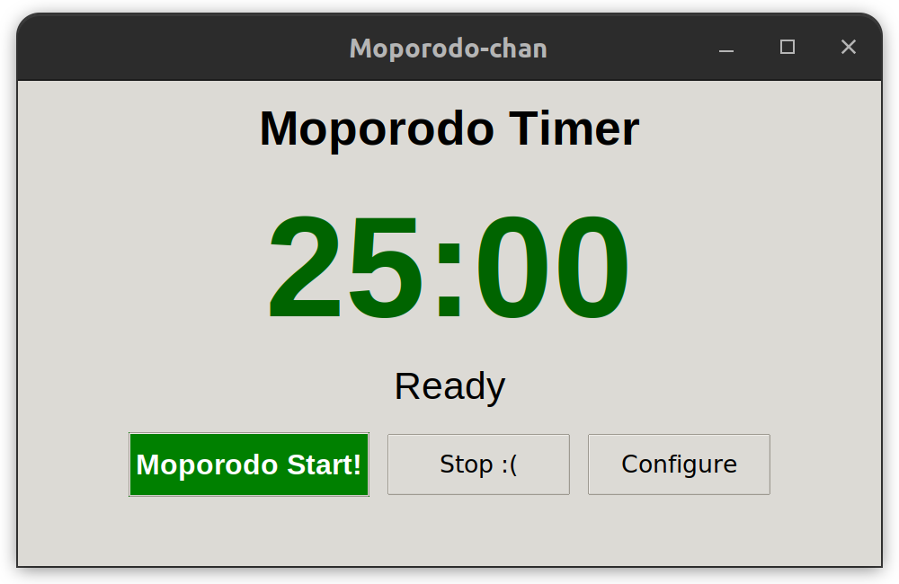
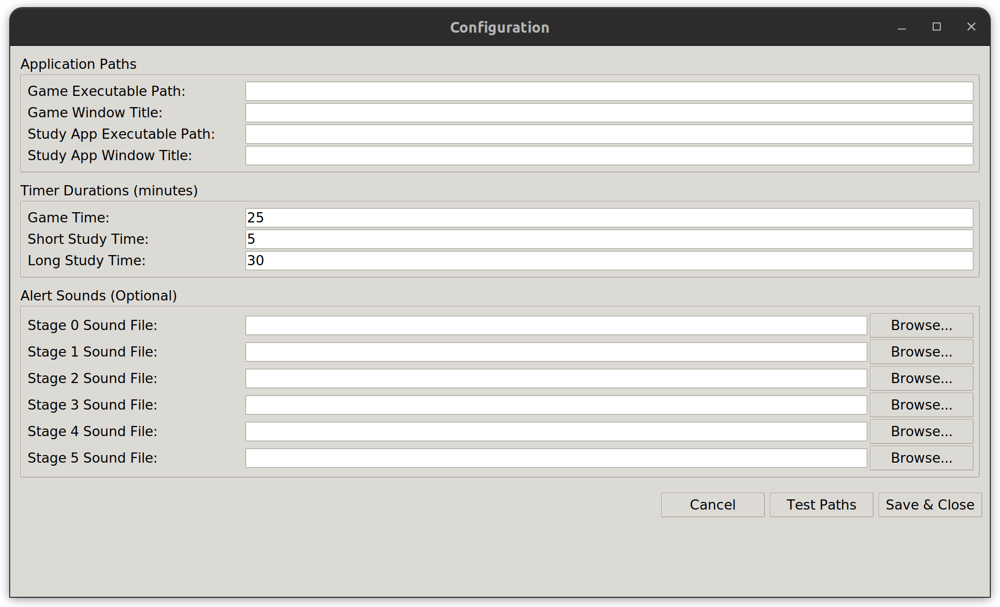

# Moporodo

A Python-based Pomodoro timer application that enforces focus by monitoring window activity and playing escalating audio alerts when you lose focus on your designated tasks, but for games...

## Features

- **Automated Pomodoro Cycles**: Runs 4 cycles of game time + study time, followed by a long study session
- **Focus Enforcement**: Monitors active windows and alerts you when focus is lost
- **Escalating Alerts**: 6-stage alert system with increasingly urgent notifications
- **Application Integration**: Automatically launches and switches between your game and study applications
- **Custom Audio Alerts**: Support for custom sound files (WAV, OGG recommended) with pygame
- **Configurable Timers**: Customize duration for game time, short study, and long study sessions
- **Cross-Platform**: Works on Windows, Linux, and macOS

## Screenshots


*Main timer interface showing current phase and remaining time*


*Configuration window for setting up applications and alert sounds*

## Installation

### Prerequisites

- Python 3.7 or higher
- Tkinter (usually included with Python)

### Required Dependencies

```bash
pip install pygame pywinctl
```

### Optional Audio Libraries (Linux)

For better audio format support on Linux:

```bash
sudo apt update
sudo apt install libsdl2-mixer-2.0-0 libsdl2-mixer-dev
```

## Quick Start

1. **Download and Run**:
   ```bash
   git clone https://github.com/timmmtam/Moporodo.git
   cd Moporodo.git
   ./Moporodo.py
   ```

2. **Configure Applications**:
   - Click "Configure" button
   - Set paths to your game and study applications
   - Set window titles that the app should monitor
   - Optionally add custom alert sounds

3. **Start Your Session**:
   - Click "Start Pomodoro"
   - The app will automatically launch your configured applications
   - Stay focused! Alerts will play if you switch away from the designated app

## Configuration

### Application Paths
- **Game Executable Path**: Full path to your game executable (e.g., `/usr/games/solitaire`)
- **Game Window Title**: Part of the window title to monitor (e.g., "Solitaire")
- **Study App Executable Path**: Full path to your study application
- **Study App Window Title**: Part of the study app's window title

### Timer Durations
- **Game Time**: Minutes for each game session (default: 25)
- **Short Study Time**: Minutes for short study breaks (default: 5)
- **Long Study Time**: Minutes for final long study session (default: 30)

### Alert Sounds (Optional)
- **Stage 0-5**: Custom sound files for each alert escalation level
- Supported formats: WAV, OGG (MP3 support varies by system)
- Leave empty to use system bell

## How It Works

### Pomodoro Flow
1. **Game Session 1** (25 min) → **Study Break 1** (5 min)
2. **Game Session 2** (25 min) → **Study Break 2** (5 min)
3. **Game Session 3** (25 min) → **Study Break 3** (5 min)
4. **Game Session 4** (25 min) → **Long Study Session** (30 min)

### Focus Monitoring
- The app continuously monitors which window is active
- When you lose focus (switch away from the designated app), alerts begin
- Alert stages escalate every 10 seconds of lost focus
- Alerts stop immediately when you return focus to the correct application

### Alert Stages
- **Stage 0**: Initial notification
- **Stage 1-5**: Escalating alerts (customizable sounds)
- Multiple alert sounds can play simultaneously as stages increase

## Audio Setup

### Recommended Audio Formats
1. **WAV**: Best compatibility, works on all systems
2. **OGG**: Good compression, reliable pygame support
3. **MP3**: Limited support, may not work on all systems

### Converting Audio Files
Use ffmpeg to convert MP3 files to supported formats:

```bash
# Convert MP3 to WAV
ffmpeg -i alert.mp3 alert.wav

# Convert MP3 to OGG
ffmpeg -i alert.mp3 alert.ogg
```

### Finding Alert Sounds
- Use short, attention-grabbing sounds (1-3 seconds)
- Avoid very long audio files as they repeat continuously
- Consider different intensities for different alert stages

## Troubleshooting

### Common Issues

**"Unable to open file" Error**
- Check if the audio file exists and is readable
- Try converting MP3 files to WAV format
- Ensure pygame is properly installed with audio support

**Application Won't Launch**
- Verify the executable path is correct
- Check file permissions
- Test the executable path manually in terminal

**Window Not Detected**
- Ensure the window title contains the text you specified
- Try using a shorter, more generic part of the title
- Check that the application is actually running

**Sounds Not Playing**
- Verify pygame installation: `python -c "import pygame; pygame.mixer.init()"`
- Test with WAV files instead of MP3
- Check system audio settings

### Linux-Specific Issues

**No Audio Output**
```bash
# Install additional audio libraries
sudo apt install pulseaudio-utils alsa-utils
# Test system audio
speaker-test -t wav -c 2
```

**Permission Denied**
```bash
# Fix file permissions
chmod +x your_game_executable
chmod 644 your_audio_files.wav
```

## Configuration File

Settings are stored in `config.ini`:

```ini
[Settings]
game_path = /usr/games/solitaire
game_title = Solitaire
study_app_path = /usr/bin/firefox
study_app_title = Firefox

[Durations]
game_min = 25
short_study_min = 5
long_study_min = 30

[Sounds]
stage_0 = /path/to/alert1.wav
stage_1 = /path/to/alert2.wav
# ... etc
```

## Development

### Project Structure
```
pomodoro-focus-enforcer/
├── moporodo_latest.py      # Main application
├── config.ini              # Configuration file (auto-generated)
├── README.md               # This file
└── sounds/                 # Custom alert sounds (optional)
```

### Key Components
- **PomodoroApp**: Main application class
- **ConfigWindow**: Configuration dialog
- **Focus Monitoring**: Window activity tracking
- **Sound Management**: Audio alert system
- **Application Control**: Process launching and management

### Dependencies
- `tkinter`: GUI framework
- `pygame`: Audio playback
- `pywinctl`: Cross-platform window management
- `configparser`: Configuration file handling
- `threading`: Background task management

## Contributing

1. Fork the repository
2. Create a feature branch
3. Make your changes
4. Test on multiple platforms if possible
5. Submit a pull request

## License

This project is licensed under the MIT License - see the LICENSE file for details.

## Support

If you encounter issues:

1. Check the troubleshooting section above
2. Verify all dependencies are installed correctly
3. Test with simple applications first (like notepad/gedit)
4. Create an issue with your system details and error messages

---

**Note**: This application is designed to help with productivity through the Pomodoro Technique. The focus enforcement features work best when you genuinely want to maintain focus rather than trying to circumvent them.
